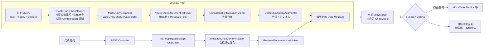

# WiseLink AI（智选灵犀）

> **Gen AI Agent · Industrial-grade shopping copilot on the JVM**

WiseLink AI 是一款面向电商场景的 **导购 Agent**：以 **Spring Boot 3.4** 为运行时底座，以 **Spring AI Modular RAG** 为检索增强内核，将「有据可依的零幻觉约束」与「高情商、场景化的导购表达」压进同一条推理链路。我们不追求话术堆砌，追求 **可观测、可隔离、可演进** 的工程化交付。

> **项目状态（2026）**：核心导购 / RAG / Manus / MCP 工具链 **已可完整演示**；日常以文档与 **`target/config` 外置配置** 为准维护。克隆运行见下文「快速开始 / 生产部署」。

---

## WiseLink 生态仓库（三仓分工）

WiseLink 按职责拆为 **三个独立 GitHub 仓库**，本仓库为 **主应用（Java 导购 Agent）**；联调时请分别克隆并对齐端口 / 环境变量。

| 仓库 | 说明 | 默认端口 / 协议 |
|------|------|-----------------|
| **本仓库**（`gen-ai-agent-java`） | 导购与 Manus 编排、Modular RAG、敏感词、应用内工具、**MCP Client（Stdio 拉起子进程）**；HTTP API 前缀 `/api` | **8081** |
| [**wiselink-console-ui**](https://github.com/leungtzemeen/wiselink-console-ui) | **对话控制台前端**：Vue 3 + Vite + TypeScript；对接本仓库 **`GET /ai/chat`**（流式）与 **`GET /ai/chat/manus`**（`event: manus` / `done`）；自研 SSE 解析、`AbortController` 断流、Manus 步进面板与 Markdown 渲染；支持 Docker / Nginx 静态部署（**须 `proxy_buffering off`**） | 开发 **5173**；生产由 Nginx 反代 `/api` → 8081 |
| [**wiselink-mcp-ecosystem**](https://github.com/leungtzemeen/wiselink-mcp-ecosystem) | **MCP Server 子进程**：由主应用 stdio 拉起；提供 **`exportShoppingReport`**（Markdown → PDF）等工具；同时在 **8082** 提供 HTTP（PDF `/exports/**`、MCP WebMVC）。工作区与日志由 **`WISELINK_MCP_WORKSPACE_ROOT`** 驱动；配置与 logback 与主仓同样 **jar / `target/config` 分离** | **8082**（HTTP）；stdio 与主应用通信 |

**联调关系（简图）**：

```
浏览器 → wiselink-console-ui → HTTP/SSE → 本仓库 :8081/api
                              ↘ stdio MCP ↘ wiselink-mcp-ecosystem（+ 高德 map-server 等）
```

主应用 `application.yml` 中 `wiselink-mcp-ecosystem` 的 jar 路径、`--spring.config.location`、`--logging.config` 需指向 ecosystem 仓库 **`target/`** 产物；前端 `.env` 中 `VITE_API_BASE` 建议走同源 `/api` 代理。各仓 README 有各自的构建与部署说明。

---

## 核心能力清单

- **WiseLink AI（智选灵犀）**：Java 21 + Spring Boot 3.4 + Spring AI 1.1 的 **电商导购 Agent**，Modular RAG（查询重写 → 分身扩展 → 向量检索 → 上下文注入）+ Function Calling + MCP 外部工具。
- **多模型拨码**：`wiselink.active-brain` 切换 DashScope / DeepSeek / Ollama；Manus 多步编排 **循环外冻结 ChatClient**，避免步间误换模型。
- **Manus 多步 Agent**：`DefaultManusOrchestrator` + 默认 **`react`** 执行器（think + act）；HTTP **`SseEmitter`** 推送 `event: manus` / `done` 步事件，可观测 `traceId`、工具预算跨步累计。
- **工程化**：敏感词 DFA、单请求工具预算、Kryo 会话落盘、知识库指纹短路（见 `docs/rag-sidecar.md` 说明）、jar 与 **`application.yml` / `logback` 分离打包**。
- **MCP**：Stdio 挂载 **高德地图 MCP** + 自研 **wiselink-mcp-ecosystem** 子进程；子进程通过外置 `spring.config.location` / `logging.config` 避免与主应用端口、stdio 协议冲突。

---

## 1. 项目简介

- **定位**：基于 **Spring Boot 3.4.x** + **Spring AI 1.1.x** 构建的 **工业级导购 Agent**，会话记忆、工具调用、向量检索与安全闸口一等公民化。
- **大脑（可拨码）**：由 **`wiselink.active-brain`** 选择运行时对接的 **`ChatModel`**，常见取值为 **`dashscope`**（阿里云百炼）、**`deepseek`**（OpenAI 兼容 REST，默认基址 `api.deepseek.com`）、**`ollama`**（本地）。导购与 **Manus** 均通过 Spring AI **`ChatClient`** 编排，具体 Bean 与工厂见 `ShoppingGuideChatClientFactory`、`ManusOrchestrationConfiguration` 等。
- **信条**：**Grounded Generation**——先锁住检索与工具边界，再放开模型文采；对用户诚实，对业务合规。

---

## 2. 核心特性（Key Features）

### 全明星 Modular RAG 流水线

RAG 不走手工拼接 Prompt 的野路子，而是 **`RetrievalAugmentationAdvisor`** 标准编排：

| 阶段 | 组件（文档术语） | WiseLink 落地的意图 |
|------|------------------|---------------------|
| **Query Transformer** | **`RewriteQueryTransformer`** | 将多轮对话 **重写为可检索的 standalone 查询**；模板强制 **商品主体落地**，专治「它/这个/那款」导致的 **检索漂移**（代词失忆）。无历史时短路，省一次 LLM。 |
| **架构实现** | *Implementation note* | 文档层统一称 **RewriteQueryTransformer**；工程实现上由 Spring AI **`CompressionQueryTransformer`**（对话压缩机制） + **`ShortCircuitCompressionQueryTransformer`**（`com.gen.ai.infrastructure.rag.query`）承载，WiseLink 自定义 Prompt 完成「检索侧语义重写」。 |
| **Query Expander** | **`MultiQueryExpander`（分身检索）** | **`WiseLinkMultiQueryExpander`**：LLM 产出最多 3 条中文检索变体（格式解析加固），**当前实现仅取第 1 条做向量检索**（降本、控延迟）；保留多行生成是为防模型格式抖动。改写调用带 **开始/结束 + elapsedMs** 日志便于排障。 |
| **Retriever** | **`VectorStoreDocumentRetriever`** | TopK + **similarity threshold** + **Metadata Filter** 精准收敛。 |
| **Augmenter** | **`ContextualQueryAugmenter`** | `assistant-guide.st` 内嵌模板注入上下文，强调 **有据可依**、禁止无片段支撑的断言。 |

### 多维安全防御

- **本地 DFA**：基于 **Hutool `WordTree`** 的内存敏感词检测（`SensitiveWordService`）。
- **词库形态**：`classpath:sensitive_words.bin`（Base64 封装 UTF-8 词表）+ 可选 **影子词**（`app.security.shadow-words-base64`）。**设计上支持万级词条装载**（生产环境推荐 **≥ 1.5 万条** 公开词 + 影子策略分层）。
- **全局兜底**：`GlobalExceptionHandler` 统一异常出口，避免栈痕裸奔、接口语义漂移。
- **密钥治理**：各厂商 **API Key 仅允许经环境变量注入**，仓库内的 YAML **不出现明文密钥**（见下文「配置说明」）。

### 元数据与检索（biz_category）

- 文档入库时仍可写入 **`biz_category`** 等业务 Metadata，便于向量侧过滤与数据治理。
- **当前 HTTP 导购 / Manus 入口**：不再通过 Query 传 `category`；RAG 侧 **不按 HTTP 注入 `FILTER_EXPRESSION`**（全库相似度检索，由 TopK / threshold 等约束）。若需恢复「按类目收窄检索」，应在应用层重新接线并同步文档。

### HTTP 与跨域（摘要）

| 路径（均相对于 `server.servlet.context-path`，默认 **`/api`**） | 说明 |
|--------|------|
| **`GET /ai/chat`** | 流式导购（**`Flux<String>`** SSE）；**必传** `prompt`、`sessionId`。 |
| **`GET /ai/chat/manus`** | Manus 多步 SSE（**`SseEmitter`**，`event: manus` / `done`，步事件逐帧写出）；**必传** `prompt`、`sessionId`；默认 **`step-executor: react`**；外层步数 **`wiselink.manus.max-steps`**（默认 10）。生产经 Nginx 反代时应对该路径 **关闭 `proxy_buffering`**。 |
| **`POST /ai/admin/import`**、**`DELETE /ai/admin/clear`** | 知识库运维，见 **`SystemController`**；由 **`LocalhostOnlyAdminInterceptor`** 限制为 **本机 loopback** 可调，便于本机 `curl`。 |
| **CORS** | **`WebMvcAppConfiguration`** 对 `/**` 注册宽松跨域（`allowedOriginPatterns("*")` 等），减轻前后端分离时的浏览器预检问题。 |

### 实时工具联动（Function Calling + MCP）

- **应用内工具**：**`searchProductsFunction`** 等，按关键词 / 价格区间查本地商品 JSON，结构化返回。
- **MCP（Stdio）**（`spring.ai.mcp.client`，见 `application.yml`）：
  - **`map-server`**：**`@amap/amap-maps-mcp-server`**（需 **`AMAP_MAP_KEY`** 环境变量）。
  - **`wiselink-mcp-ecosystem`**：独立 Spring Boot jar，由主应用拉起；须配置 **`WISELINK_MCP_WORKSPACE_ROOT`**，并通过 **`--spring.config.location`** / **`--logging.config`** 指向 **`target/config/`** 下外置 yml 与 logback（避免子进程误读 jar 内默认配置、且日志走 stderr 不污染 MCP stdio）。
- 人设模板约束：**可核对的商品字段须以工具返回为准**，禁止凭记忆脑补目录或价格。

---

## 3. 技术栈

| 类别 | 技术 |
|------|------|
| 运行时 | Java **21**、Spring Boot **3.4.x** |
| Web | **spring-boot-starter-web**（CORS、拦截器）；**`/ai/chat`** 为 **Reactor `Flux`** 流式 SSE；**`/ai/chat/manus`** 为 **`SseEmitter`** 命名事件 SSE；与 **webflux** 依赖共存 |
| AI 编排 | **Spring AI**（`ChatClient`、`RetrievalAugmentationAdvisor`、`VectorStoreDocumentRetriever`、**RewriteQueryTransformer**（实现：`CompressionQueryTransformer`）、`MultiQueryExpander`（实现：`WiseLinkMultiQueryExpander`）、`ContextualQueryAugmenter`） |
| 模型接入 | **Spring AI Alibaba · DashScope**；**Spring AI OpenAI 兼容客户端**（如 **DeepSeek** `api.deepseek.com`）；**Ollama**（本地）；由 **`wiselink.active-brain`** 切换 |
| 工具与协议 | **Spring AI MCP Client**（Stdio 连接外部 MCP）；应用内 **Function Calling** / `ToolCallback` |
| 向量与文档 | **Spring AI VectorStore**、`spring-ai-markdown-document-reader`、`spring-ai-advisors-vector-store` |
| 工具库 | **Hutool**（DFA 等） |
| 会话持久 | **Kryo**（`FileChatMemoryRepository` + **`MessageWindowChatMemory`**，路径见 `app.storage`） |
| Manus | **`DefaultManusOrchestrator`**、`ManusChatSseService`（**`SseEmitter`**）；默认 **`ReactToolCallingManusStepExecutor`**（`wiselink.manus.step-executor: react`） |
| API 文档 | **springdoc-openapi**、**Knife4j** |

---

## 4. 架构设计（处理流水线）

### Mermaid：从用户提问到模型输出



### 一句话心智模型

**RewriteQueryTransformer** 把「聊散的」变成「能搜的」→ **MultiQueryExpander** 生成检索变体（当前取首条检索）→ **Retriever** 从向量库捞出证据 → **ContextualQueryAugmenter** 把证据钉进 User 侧提示 → **LLM + Tools** 在约束下完成高情商导购。

### 包结构约定（Java）

为避免「同名包分散两处、单复数相近」带来的查找成本，代码按职责收敛如下（找类时先看这一节）：

| 包路径 | 放什么 |
|--------|--------|
| **`com.gen.ai.infrastructure.rag.query`** | Modular RAG **查询链**上的组件（如 **`WiseLinkMultiQueryExpander`**、**`ShortCircuitCompressionQueryTransformer`**），与 Spring AI `QueryExpander` / `QueryTransformer` 对齐。 |
| **`com.gen.ai.infrastructure.rag.*`**（`service`、`pipeline`、`context`、`extractor`、`ingestion`、`model`、`bootstrap`、`revision` 等） | 向量 **灌库 / 索引 / 指纹侧车 / 文档提取** 等；源指纹短路与判重侧车说明见 **`docs/rag-sidecar.md`**（本地文档，可能未入库）。 |
| **`com.gen.ai.infrastructure.agent.toolcallback`** | **框架向** 的 `ToolCallback` 装饰：单次请求调用预算、观测截断、`ToolCallback` 组合顺序等；**不要**与业务工具包混淆。 |
| **`com.gen.ai.wiselink.tools`** | WiseLink **业务工具**（如商品查询等），面向领域能力命名。 |
| **`com.gen.ai.infrastructure.security`** | 应用级 **敏感词 / 合规**（如 `SensitiveWordService`）。 |
| **`com.gen.ai.application.manus`** | **Manus** 编排、HTTP/SSE 出口、执行器与策略（与导购共用 `ChatClient` 工厂与记忆）。 |
| **`com.gen.ai.web`** | **REST Controller**（如 `AiShoppingGuideController`、`SystemController`）与 **`LocalhostOnlyAdminInterceptor`**（本机运维限制）。 |

### Manus 模式：多步循环下的模型选择（Phase 4 HTTP 已接）

若实现 **Manus**（外层显式多步、每步再调 `ChatClient`），须遵守以下约定，避免历史上曾出现的问题：**第 1 步用了用户指定的模型（如 Ollama），第 2 步又落回容器默认的百炼（DashScope），导致云端 token 被误烧**。

- **原则**：**模型选择在循环外解析一次，循环内只消费同一个 `ChatClient` / `ChatModel`。**  
  即在进入 `while` / `for` 多步循环之前，根据用户选择（或会话策略）**固定**解析出本次任务要用的那条模型链路；循环内每一步 **禁止** 再无参 `ChatClient.builder().build()` 或仅依赖 `@Primary` `ChatModel` 重新取默认实现。
- **延伸检查**：RAG / Advisor 等若会**单独**发起 LLM 调用，须确认其使用的也是**同一条**模型配置，否则会表现为「某一步悄悄换了大脑」。
- **流程与 RAG 策略的图示说明**：见 [`docs/MANUS-ARCHITECTURE.md`](./docs/MANUS-ARCHITECTURE.md)。
- **分阶段实现设计（接口、包结构、Phase 1～5、扩展点）**：见 [`docs/MANUS-DESIGN-PHASES.md`](./docs/MANUS-DESIGN-PHASES.md)、[`docs/MANUS-ARCHITECTURE.md`](./docs/MANUS-ARCHITECTURE.md)。**Phase 4 HTTP**：`GET /ai/chat/manus` 返回 **`SseEmitter`**，在 `boundedElastic` 中跑编排，经 **`send`** 推送 `event: manus`（步事件 JSON，`traceId` / `activeBrainTag` 等）与 `event: done`；默认 **`step-executor: react`**。普通流式仍为 **`GET /ai/chat`**（`Flux`）。**Phase 5**：结构化日志，grep 前缀 `>>>> [Manus-`。

---

## 5. 快速开始

### 环境

- **JDK 21+**
- **Maven 3.9+**
- **与 `wiselink.active-brain` 对齐的 API Key（必填其一或多项）**  
  - **`dashscope`**：设置 **`AI_DASHSCOPE_API_KEY`**，绑定 `spring.ai.dashscope.api-key`。  
  - **`deepseek`**（仓库默认配置常见）：设置 **`AI_DEEPSEEK_API_KEY`**，绑定 `spring.ai.openai.api-key`（`base-url` 指向 DeepSeek 兼容端点）。  
  - **`ollama`**：一般无需云端 Key；需本机已启动 Ollama 且模型与 `application.yml` 一致。  
  未设置当前大脑所依赖的占位符时 Spring 会 **启动失败（fail-fast）**；密钥请勿写入仓库或 YAML，详见 §6。
- **MCP（可选）**：**`WISELINK_MCP_WORKSPACE_ROOT`**、**`AMAP_MAP_KEY`**；不联调外部工具时可设 `spring.ai.mcp.client.enabled: false`。
- 可写本地目录：默认 **`./data`**（向量索引、知识库、会话历史等，见 `app.storage`）

### 依赖安装

```bash
mvn -q -DskipTests dependency:resolve
```

### 启动

按你在 `application.yml` 中的 **`wiselink.active-brain`** 设置对应环境变量。以下为 **`deepseek`** 与 **`dashscope`** 各一例（二选一或按需要同时导出，以激活的大脑为准）。

```bash
# Windows PowerShell — DeepSeek
$env:AI_DEEPSEEK_API_KEY = "your-key"
mvn spring-boot:run
```

```bash
# Windows PowerShell — DashScope
$env:AI_DASHSCOPE_API_KEY = "sk-your-key"
mvn spring-boot:run
```

```bash
# Linux / macOS — DeepSeek
export AI_DEEPSEEK_API_KEY="your-key"
mvn spring-boot:run
```

默认 **`http://localhost:8081/api`**（`context-path: /api`）。  
Swagger / Knife4j：**`/api/swagger-ui.html`**（具体路径以 `springdoc` 配置为准）。

### 生产部署（jar 与配置分离）

`mvn package` 后：

| 产物 | 说明 |
|------|------|
| **`target/gen-ai-agent-*.jar`** | 运行包；**不含** `application.yml`、`logback-spring.xml`（由 `maven-jar-plugin` 排除）。 |
| **`target/config/`** | 外置 **`application*.yml`**、**`logback*.xml`**，部署时与 jar 同目录或按运维规范挂载。 |

启动示例（在含 `config/` 的目录下，或显式指定配置路径）：

```bash
export AI_DEEPSEEK_API_KEY="your-key"
# 若启用 MCP ecosystem / 高德，另设：
# export WISELINK_MCP_WORKSPACE_ROOT="/path/to/wiselink-mcp-ecosystem-repo"
# export AMAP_MAP_KEY="your-amap-key"

java -jar gen-ai-agent-0.0.1-SNAPSHOT.jar \
  --spring.config.additional-location=file:./config/application.yml
```

联调 **wiselink-mcp-ecosystem** 时，请先在该仓库执行 `mvn package`，保证 **`${WISELINK_MCP_WORKSPACE_ROOT}/target/config/`** 与 jar 路径与主应用 `application.yml` 中 `stdio.connections.wiselink-mcp-ecosystem.args` 一致。

### 可选：敏感词库

将词表以 UTF-8 文本 **Base64 编码** 写入 **`src/main/resources/sensitive_words.bin`**（每行一词，`#` 行为注释），启动时由 `SensitiveWordService` 载入。

---

## 6. 配置说明（安全优先）

### DashScope API Key（使用 `wiselink.active-brain: dashscope` 时）

1. **推荐方式**：通过环境变量 **`AI_DASHSCOPE_API_KEY`** 注入，**禁止**在 `application.yml`、`application-*.yml`、仓库文档或脚本中写入 **明文密钥**。
2. **Spring 绑定**：`spring.ai.dashscope.api-key: ${AI_DASHSCOPE_API_KEY}`；未设置时占位符无法解析，应用 **启动失败（fail-fast）**。
3. **模型与其它参数**：可在 `spring.ai.dashscope.chat.options` 下调整 **model** 等非敏感项。

### DeepSeek / OpenAI 兼容端点（使用 `wiselink.active-brain: deepseek` 时）

1. **推荐方式**：通过环境变量 **`AI_DEEPSEEK_API_KEY`** 注入（与主配置 `spring.ai.openai.api-key: ${AI_DEEPSEEK_API_KEY}` 对应）。
2. **`base-url` / `model`**：见 `application.yml` 中 `spring.ai.openai`；勿在仓库中提交明文 Key。

### MCP 与地图（启用 `spring.ai.mcp.client` 时）

| 变量 | 用途 |
|------|------|
| **`WISELINK_MCP_WORKSPACE_ROOT`** | **wiselink-mcp-ecosystem** 工程根目录；主应用 Stdio 拉起子 jar 及 **`target/config/application.yml`**、**`logback-spring.xml`**。 |
| **`AMAP_MAP_KEY`** | 高德 MCP（`map-server`）所需，映射为子进程环境变量 `AMAP_MAPS_API_KEY`。 |

未配置时：主应用仍可启动（可将 `spring.ai.mcp.client.enabled` 设为 `false`）；地图 / ecosystem 工具不可用。

### 通用

- **团队协作**：使用 CI/CD Secret、本地 `.env`（已加入 `.gitignore`）、或各 IDE Run Configuration 注入环境变量；**轮换密钥**后无需改代码，只需更新部署环境。
- 若曾将密钥写入 Git，请立刻 **作废旧 Key** 并改用环境变量。

### 可选本地覆盖

`application-dev.yml` 通过 `optional:classpath:` 引入，**仅用于非敏感覆盖**（例如模型名）；请保持其中 **不出现** `api-key` 字段。

### 集成测试

`DashScopeTest` 会真实调用 DashScope，仅在环境变量 **`AI_DASHSCOPE_API_KEY`** 已设置（非空）时执行；本地未配置时该类测试会被 **跳过**，不影响 `mvn test` 通过。

---

## 7. 愿景：零幻觉 × 高情商

- **零幻觉**：检索模板 + 工具协议 + Metadata 分区，把「能说」限制在「有证据或已实测」之内。  
- **高情商**：人设与追问策略写在 `prompts/assistant-guide.st`，工程上与人格解耦、与 RAG 模板分段共存，可持续迭代。

---

*WiseLink —— 让每一次推荐，都有回路可查。*
