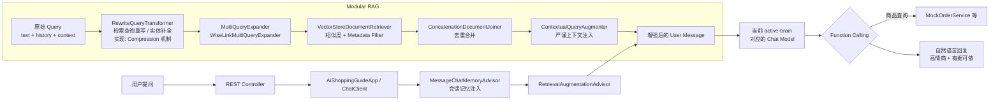

# WiseLink AI（智选灵犀）

> **Gen AI Agent · Industrial-grade shopping copilot on the JVM**

WiseLink AI 是一款面向电商场景的 **导购 Agent**：以 **Spring Boot 3.4** 为运行时底座，以 **Spring AI Modular RAG** 为检索增强内核，将「有据可依的零幻觉约束」与「高情商、场景化的导购表达」压进同一条推理链路。我们不追求话术堆砌，追求 **可观测、可隔离、可演进** 的工程化交付。

> **维护状态（2026）**：本仓库 **后端阶段性交付已收敛**，当前以文档与配置为准做 **非活跃维护**（缺陷与安全补丁视需要处理）。后续产品演进可能在其他仓库继续；克隆运行请以 **`application.yml`** + 本文「快速开始 / 配置说明」为准。

---

## 1. 项目简介

- **定位**：基于 **Spring Boot 3.4.x** + **Spring AI 1.1.x** 构建的 **工业级导购 Agent**，会话记忆、工具调用、向量检索与安全闸口一等公民化。
- **大脑（可拨码）**：由 **`wiselink.active-brain`** 选择运行时对接的 **`ChatModel`**，常见取值为 **`dashscope`**（阿里云百炼）、**`deepseek`**（OpenAI 兼容 REST，默认基址 `api.deepseek.com`）、**`ollama`**（本地）。导购与 **Manus** 均通过 Spring AI **`ChatClient`** 编排，具体 Bean 与工厂见 `ShoppingGuideChatClientFactory`、`ManusOrchestrationConfiguration` 等。
- **信条**：**Grounded Generation**——先锁住检索与工具边界，再放开模型文采；对用户诚实，对业务合规。

---

## 2. 核心特性（Key Features）

### 全明星 Modular RAG 流水线

RAG 不走手工拼接 Prompt 的野路子，而是 **`RetrievalAugmentationAdvisor`** 标准编排：

| 阶段 | 组件（文档术语） | WiseLink 落地的意图 |
|------|------------------|---------------------|
| **Query Transformer** | **`RewriteQueryTransformer`** | 将多轮对话 **重写为可检索的 standalone 查询**；模板强制 **商品主体落地**，专治「它/这个/那款」导致的 **检索漂移**（代词失忆）。无历史时短路，省一次 LLM。 |
| **架构实现** | *Implementation note* | 文档层统一称 **RewriteQueryTransformer**；工程实现上由 Spring AI **`CompressionQueryTransformer`**（对话压缩机制） + **`ShortCircuitCompressionQueryTransformer`**（`com.gen.ai.infrastructure.rag.query`）承载，WiseLink 自定义 Prompt 完成「检索侧语义重写」。 |
| **Query Expander** | **`MultiQueryExpander`（分身检索）** | **`WiseLinkMultiQueryExpander`**（包：`com.gen.ai.infrastructure.rag.query`，`QueryExpander`，语义对齐 **`MultiQueryExpander`**）：一路改三路，并行召回 + join 去重；解析规则针对中文导购加固。 |
| **Retriever** | **`VectorStoreDocumentRetriever`** | TopK + **similarity threshold** + **Metadata Filter** 精准收敛。 |
| **Augmenter** | **`ContextualQueryAugmenter`** | `assistant-guide.st` 内嵌模板注入上下文，强调 **有据可依**、禁止无片段支撑的断言。 |

### 多维安全防御

- **本地 DFA**：基于 **Hutool `WordTree`** 的内存敏感词检测（`SensitiveWordService`）。
- **词库形态**：`classpath:sensitive_words.bin`（Base64 封装 UTF-8 词表）+ 可选 **影子词**（`app.security.shadow-words-base64`）。**设计上支持万级词条装载**（生产环境推荐 **≥ 1.5 万条** 公开词 + 影子策略分层）。
- **全局兜底**：`GlobalExceptionHandler` 统一异常出口，避免栈痕裸奔、接口语义漂移。
- **密钥治理**：各厂商 **API Key 仅允许经环境变量注入**，仓库内的 YAML **不出现明文密钥**（见下文「配置说明」）。

### 元数据与检索（biz_category）

- 文档入库时仍可写入 **`biz_category`** 等业务 Metadata，便于向量侧过滤与数据治理。
- **当前 HTTP 导购 / Manus 入口**：不再通过 Query 传 `category`；RAG 侧 **不按 HTTP 注入 `FILTER_EXPRESSION`**（全库相似度检索，由 TopK / threshold 等约束）。若需恢复「按类目收窄检索」，应在应用层重新接线并同步文档。

### HTTP 与跨域（摘要）

| 路径（均相对于 `server.servlet.context-path`，默认 **`/api`**） | 说明 |
|--------|------|
| **`GET /ai/chat`** | 流式导购；**必传** `prompt`、`sessionId`。 |
| **`GET /ai/chat/manus`** | Manus SSE（`event: manus` / `done`）；**必传** `prompt`、`sessionId`；外层步数由 **`wiselink.manus.max-steps`** 配置；**`wiselink.manus.step-executor`**=`single-call` \| `react`。 |
| **`POST /ai/admin/import`**、**`DELETE /ai/admin/clear`** | 知识库运维，见 **`SystemController`**；由 **`LocalhostOnlyAdminInterceptor`** 限制为 **本机 loopback** 可调，便于本机 `curl`。 |
| **CORS** | **`WebMvcAppConfiguration`** 对 `/**` 注册宽松跨域（`allowedOriginPatterns("*")` 等），减轻前后端分离时的浏览器预检问题。 |

### 实时工具联动（Function Calling）

- 注册 **`searchProductsFunction`** 等函数 Bean：按关键词 / 价格区间查询本地商品目录 JSON，返回结构化列表（不含时间戳字段），便于向用户展示；另可通过 **Spring AI MCP Client（Stdio）** 挂载地图等外部工具（见 `application.yml` 中 `spring.ai.mcp.client`）。
- 人设模板约束：**可核对的商品字段（如价格文案、规格列表）须以工具返回为准**，禁止凭记忆「脑补目录或价格」——把 **零幻觉** 从口号做成 **协议**。

---

## 3. 技术栈

| 类别 | 技术 |
|------|------|
| 运行时 | Java **21**、Spring Boot **3.4.x** |
| Web | **spring-boot-starter-web**（`DispatcherServlet`、`HandlerInterceptor`、全局 CORS）；部分接口返回 **Reactor `Flux`**（SSE），与 **spring-boot-starter-webflux** 共存于同一应用 |
| AI 编排 | **Spring AI**（`ChatClient`、`RetrievalAugmentationAdvisor`、`VectorStoreDocumentRetriever`、**RewriteQueryTransformer**（实现：`CompressionQueryTransformer`）、`MultiQueryExpander`（实现：`WiseLinkMultiQueryExpander`）、`ContextualQueryAugmenter`） |
| 模型接入 | **Spring AI Alibaba · DashScope**；**Spring AI OpenAI 兼容客户端**（如 **DeepSeek** `api.deepseek.com`）；**Ollama**（本地）；由 **`wiselink.active-brain`** 切换 |
| 工具与协议 | **Spring AI MCP Client**（Stdio 连接外部 MCP）；应用内 **Function Calling** / `ToolCallback` |
| 向量与文档 | **Spring AI VectorStore**、`spring-ai-markdown-document-reader`、`spring-ai-advisors-vector-store` |
| 工具库 | **Hutool**（DFA 等） |
| 会话持久 | **Kryo**（`FileChatMemoryRepository` + **`MessageWindowChatMemory`**，路径见 `app.storage`） |
| Manus | **`DefaultManusOrchestrator`**、`ManusChatSseService`；执行器 **`SpringAiManusStepExecutor`** / **`ReactToolCallingManusStepExecutor`**（`wiselink.manus.step-executor`） |
| API 文档 | **springdoc-openapi**、**Knife4j** |

---

## 4. 架构设计（处理流水线）

### Mermaid：从用户提问到模型输出



### 一句话心智模型

**RewriteQueryTransformer** 把「聊散的」变成「能搜的」→ **MultiQueryExpander** 把「能搜的」变成「多视角搜」→ **Retriever** 从向量库捞出证据 → **ContextualQueryAugmenter** 把证据钉进 User 侧提示 → **LLM + Tools** 在约束下完成高情商导购。

### 包结构约定（Java）

为避免「同名包分散两处、单复数相近」带来的查找成本，代码按职责收敛如下（找类时先看这一节）：

| 包路径 | 放什么 |
|--------|--------|
| **`com.gen.ai.infrastructure.rag.query`** | Modular RAG **查询链**上的组件（如 **`WiseLinkMultiQueryExpander`**、**`ShortCircuitCompressionQueryTransformer`**），与 Spring AI `QueryExpander` / `QueryTransformer` 对齐。 |
| **`com.gen.ai.infrastructure.rag.*`**（`service`、`pipeline`、`context`、`extractor`、`ingestion`、`model`、`bootstrap`、`revision` 等） | 向量 **灌库 / 索引 / 指纹侧车 / 文档提取** 等与「数据面」相关的实现。 |
| **`com.gen.ai.infrastructure.agent.toolcallback`** | **框架向** 的 `ToolCallback` 装饰：单次请求调用预算、观测截断、`ToolCallback` 组合顺序等；**不要**与业务工具包混淆。 |
| **`com.gen.ai.wiselink.tools`** | WiseLink **业务工具**（如商品查询等），面向领域能力命名。 |
| **`com.gen.ai.infrastructure.security`** | 应用级 **敏感词 / 合规**（如 `SensitiveWordService`）。 |
| **`com.gen.ai.application.manus`** | **Manus** 编排、HTTP/SSE 出口、执行器与策略（与导购共用 `ChatClient` 工厂与记忆）。 |
| **`com.gen.ai.web`** | **REST Controller**（如 `AiShoppingGuideController`、`SystemController`）与 **`LocalhostOnlyAdminInterceptor`**（本机运维限制）。 |

### Manus 模式：多步循环下的模型选择（Phase 4 HTTP 已接）

若实现 **Manus**（外层显式多步、每步再调 `ChatClient`），须遵守以下约定，避免历史上曾出现的问题：**第 1 步用了用户指定的模型（如 Ollama），第 2 步又落回容器默认的百炼（DashScope），导致云端 token 被误烧**。

- **原则**：**模型选择在循环外解析一次，循环内只消费同一个 `ChatClient` / `ChatModel`。**  
  即在进入 `while` / `for` 多步循环之前，根据用户选择（或会话策略）**固定**解析出本次任务要用的那条模型链路；循环内每一步 **禁止** 再无参 `ChatClient.builder().build()` 或仅依赖 `@Primary` `ChatModel` 重新取默认实现。
- **延伸检查**：RAG / Advisor 等若会**单独**发起 LLM 调用，须确认其使用的也是**同一条**模型配置，否则会表现为「某一步悄悄换了大脑」。
- **流程与 RAG 策略的图示说明**：见 [`docs/MANUS-ARCHITECTURE.md`](./docs/MANUS-ARCHITECTURE.md)。
- **分阶段实现设计（接口、包结构、Phase 1～5、扩展点）**：见 [`docs/MANUS-DESIGN-PHASES.md`](./docs/MANUS-DESIGN-PHASES.md)。**Phase 1～3** 已在 `com.gen.ai.application.manus` 落地。**Phase 4 HTTP**：`GET /ai/chat/manus`（配合 `server.servlet.context-path: /api` 时为 **`/api/ai/chat/manus`**）必传 `prompt`、`sessionId`；外层步上限由 **`wiselink.manus.max-steps`**（以仓库内 `application.yml` 为准）配置，不再接受 `maxSteps`/`category` 查询参数；`text/event-stream`。普通流式 `GET /ai/chat` 同样必传 `prompt`、`sessionId`。SSE 事件名 `manus`（步事件 JSON，含 Phase A 可观测字段与 **Phase C** `traceId` / `activeBrainTag`；可选 **Phase B** `PLAN_SNIPPET`，由 `wiselink.manus.planner`=`noop`|`llm` 控制；**Phase D** 执行器 `wiselink.manus.step-executor`=`single-call`|`react`（`react` 为 think+act 多外层步）与 `done`（收尾）；敏感词与现网流式导购一致。**Phase 5**（观测、工具预算累计、文档与交叉引用）：见同一文档 Phase 5；运维可 grep 前缀 `>>>> [Manus-`。

---

## 5. 快速开始

### 环境

- **JDK 21+**
- **Maven 3.9+**
- **与 `wiselink.active-brain` 对齐的 API Key（必填其一或多项）**  
  - **`dashscope`**：设置 **`AI_DASHSCOPE_API_KEY`**，绑定 `spring.ai.dashscope.api-key`。  
  - **`deepseek`**（仓库默认配置常见）：设置 **`AI_DEEPSEEK_API_KEY`**，绑定 `spring.ai.openai.api-key`（`base-url` 指向 DeepSeek 兼容端点）。  
  - **`ollama`**：一般无需云端 Key；需本机已启动 Ollama 且模型与 `application.yml` 一致。  
  未设置当前大脑所依赖的占位符时 Spring 会 **启动失败（fail-fast）**；密钥请勿写入仓库或 YAML，详见 §6。
- 可写本地目录：默认 **`./data/gen-ai-agent`**（向量索引、知识库 Markdown、会话历史等，见 `application.yml`）

### 依赖安装

```bash
mvn -q -DskipTests dependency:resolve
```

### 启动

按你在 `application.yml` 中的 **`wiselink.active-brain`** 设置对应环境变量。以下为 **`deepseek`** 与 **`dashscope`** 各一例（二选一或按需要同时导出，以激活的大脑为准）。

```bash
# Windows PowerShell — DeepSeek
$env:AI_DEEPSEEK_API_KEY = "your-key"
mvn spring-boot:run
```

```bash
# Windows PowerShell — DashScope
$env:AI_DASHSCOPE_API_KEY = "sk-your-key"
mvn spring-boot:run
```

```bash
# Linux / macOS — DeepSeek
export AI_DEEPSEEK_API_KEY="your-key"
mvn spring-boot:run
```

默认 **`http://localhost:8081/api`**（`context-path: /api`）。  
Swagger / Knife4j：**`/api/swagger-ui.html`**（具体路径以 `springdoc` 配置为准）。

### 可选：敏感词库

将词表以 UTF-8 文本 **Base64 编码** 写入 **`src/main/resources/sensitive_words.bin`**（每行一词，`#` 行为注释），启动时由 `SensitiveWordService` 载入。

---

## 6. 配置说明（安全优先）

### DashScope API Key（使用 `wiselink.active-brain: dashscope` 时）

1. **推荐方式**：通过环境变量 **`AI_DASHSCOPE_API_KEY`** 注入，**禁止**在 `application.yml`、`application-*.yml`、仓库文档或脚本中写入 **明文密钥**。
2. **Spring 绑定**：`spring.ai.dashscope.api-key: ${AI_DASHSCOPE_API_KEY}`；未设置时占位符无法解析，应用 **启动失败（fail-fast）**。
3. **模型与其它参数**：可在 `spring.ai.dashscope.chat.options` 下调整 **model** 等非敏感项。

### DeepSeek / OpenAI 兼容端点（使用 `wiselink.active-brain: deepseek` 时）

1. **推荐方式**：通过环境变量 **`AI_DEEPSEEK_API_KEY`** 注入（与主配置 `spring.ai.openai.api-key: ${AI_DEEPSEEK_API_KEY}` 对应）。
2. **`base-url` / `model`**：见 `application.yml` 中 `spring.ai.openai`；勿在仓库中提交明文 Key。

### 通用

- **团队协作**：使用 CI/CD Secret、本地 `.env`（已加入 `.gitignore`）、或各 IDE Run Configuration 注入环境变量；**轮换密钥**后无需改代码，只需更新部署环境。
- 若曾将密钥写入 Git，请立刻 **作废旧 Key** 并改用环境变量。

### 可选本地覆盖

`application-dev.yml` 通过 `optional:classpath:` 引入，**仅用于非敏感覆盖**（例如模型名）；请保持其中 **不出现** `api-key` 字段。

### 集成测试

`DashScopeTest` 会真实调用 DashScope，仅在环境变量 **`AI_DASHSCOPE_API_KEY`** 已设置（非空）时执行；本地未配置时该类测试会被 **跳过**，不影响 `mvn test` 通过。

---

## 7. 愿景：零幻觉 × 高情商

- **零幻觉**：检索模板 + 工具协议 + Metadata 分区，把「能说」限制在「有证据或已实测」之内。  
- **高情商**：人设与追问策略写在 `prompts/assistant-guide.st`，工程上与人格解耦、与 RAG 模板分段共存，可持续迭代。

---

*WiseLink —— 让每一次推荐，都有回路可查。* **仓库维护节奏见文首「维护状态」。**
