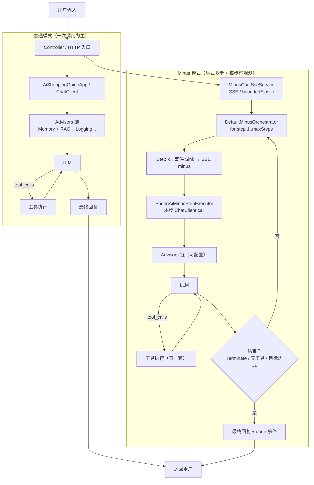
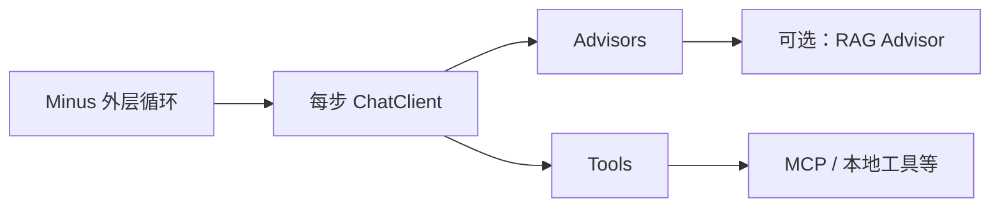
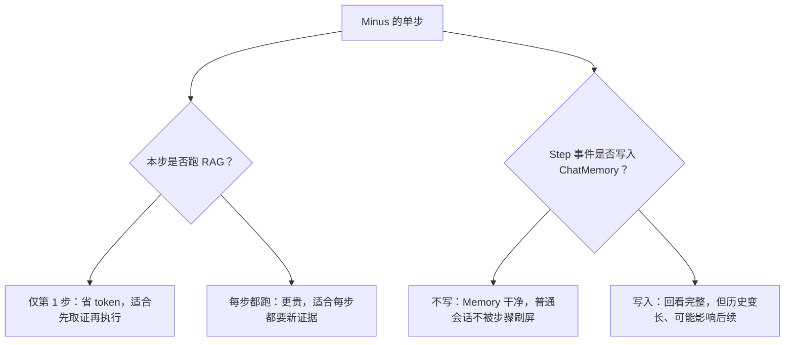

# WiseLink：普通模式 vs Minus 模式（架构说明）

> 本文件位于仓库 **`docs/`** 目录，与 [`MINUS-DESIGN-PHASES.md`](./MINUS-DESIGN-PHASES.md) 配套。

在 IDE 里打开本文件阅读；若支持 **Mermaid 预览**（如 VS Code 插件、GitHub），可直接看图；否则看 **「纯文字版」** 与 **ASCII**。

---

## 1. 总览：普通模式 vs Minus 模式

### 1.1 Mermaid（可预览）



### 1.2 纯文字版（不依赖图）

**普通模式**

1. 用户请求 → Controller  
2. `ChatClient` 一次（或框架内有限轮）调用  
3. Advisors：Memory、RAG、日志等按装配顺序参与  
4. LLM 可能发起 tool calls → 工具执行 → 再回到 LLM  
5. 用户主要看到**最终回复**

**Minus 模式**

1. 用户请求 → Controller（`GET /ai/chat/minus` 或 `GET /ai/minus`）→ `MinusChatSseService`  
2. **编排循环**：`DefaultMinusOrchestrator` 中 `step = 1 .. maxSteps`  
3. 每一轮：经 `MinusStepEventSink` 产生**步骤事件**（SSE `event: minus`，给前端「第几步」）  
4. 每一轮内部：`SpringAiMinusStepExecutor` 一次 **ChatClient** 调用 + 同一套 Advisors / Tools  
5. 根据终止条件决定继续或退出；结束时 SSE `event: done`  
6. 用户看到 **Step 1、Step 2…** + **最终回复**

**一句话**：Minus 不是替换 Spring AI，而是在外面多一层「导演」；里面仍是 ChatClient + Advisors + Tools。

---

## 2. Minus 里 RAG / 工具是否复用

### 2.1 Mermaid



### 2.2 纯文字版

- **工具**：每步仍用同一套 `ToolCallback` / 注册 / 安全 / 预算，与是否 Minus 无关。  
- **RAG**：仍是 `RetrievalAugmentationAdvisor` 一类组件；可在 Minus 里约定「仅第 1 步开 RAG」或「每步都开」，属于产品策略，不是框架限制。

---

## 3. 两个关键开关（实现前就要定）

### 3.1 Mermaid



### 3.2 纯文字版

| 决策点 | 选项 A | 选项 B |
|--------|--------|--------|
| RAG | 只在第 1 步检索（推荐默认） | 每步都检索（贵、慢） |
| Step 与 Memory | 步骤只走 SSE/前端，不进 Memory | 步骤也写入 Memory（审计友好，上下文膨胀） |

---

## 4. ASCII 总览（任意编辑器都能看）

```
普通模式:
  User -> Controller -> ChatClient -> [Advisors: Memory,RAG,...] -> LLM <-> Tools -> 最终回复 -> User

Minus 模式:
  User -> Controller -> MinusChatSseService -> DefaultMinusOrchestrator [循环 maxSteps]
              |
              v
         Step 事件 (SSE minus) -> 前端（第几步）
              |
              v
         SpringAiMinusStepExecutor -> ChatClient -> [Advisors] -> LLM <-> Tools
              |
              +-- 未结束 -> 下一轮循环
              +-- 结束 -> done + 最终回复 -> User
```

---

## 5. README 交叉引用

`README.md` 的「Minus 模式」小节指向 **`docs/MINUS-ARCHITECTURE.md`**（本文件）与 **`docs/MINUS-DESIGN-PHASES.md`**（分阶段契约）。分阶段实现细节见 [`MINUS-DESIGN-PHASES.md`](./MINUS-DESIGN-PHASES.md)。

---

## 6. 实现备忘：多步循环与「换大脑」

**原则**：**模型选择在循环外解析一次，循环内只消费同一个 `ChatClient` / `ChatModel`。**

否则易出现：Step1 使用用户指定的 Ollama，Step2 因循环内再次取默认 Bean（如 `@Primary` 百炼）而切回云端，造成 **token 误烧** 且难以察觉。

同时检查：RAG / 其它 Advisor 若会独立调 LLM，是否也绑在同一条模型链路上。

**Phase 2 落地**：导购与 Minus 通过 `ShoppingGuideChatClientFactory` 统一装配 Advisor；`DefaultMinusBrainResolver` 每次 `resolve` 冻结 `ChatClientMinusChatRuntime`（带 RAG / 无 RAG 双实例，整次 Minus 多步共用）。详见 [`MINUS-DESIGN-PHASES.md`](./MINUS-DESIGN-PHASES.md) Phase 2。

**Phase 3 落地**：`SpringAiMinusStepExecutor` 对齐导购 system / tools / memory；`FirstStepOnlyRagPolicy` 仅第一步 RAG；整次任务共享 `MinusRunContext#minusTaskToolBudget`（`AtomicInteger`）与 `PerRequestToolBudgetToolCallback` 多步累计一致。详见同一文档 **Phase 3**。

**Phase 4 落地**：`MinusChatSseService` 每请求自建 `DefaultMinusOrchestrator` + `JsonSseMinusStepEventSink`；`GET /ai/chat/minus` 与 `GET /ai/minus`；SSE `event: minus` 与 `event: done`；敏感词与 `AiShoppingGuideApp#doChatStream` 一致。详见同一文档 **Phase 4**。

**Phase 5 落地**：编排与执行器、`LoggingMinusStepEventSink` 输出带 `chatId`（会话）、`step`、`ragOn`、`runtimeId` / `identityHashCode` 等可运维字段；README 与本文收入 `docs/` 并互链。详见同一文档 **Phase 5**。
